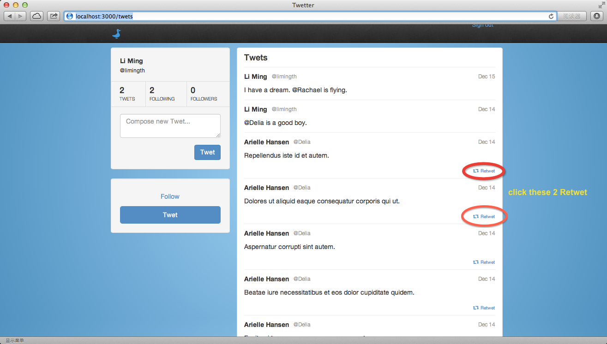
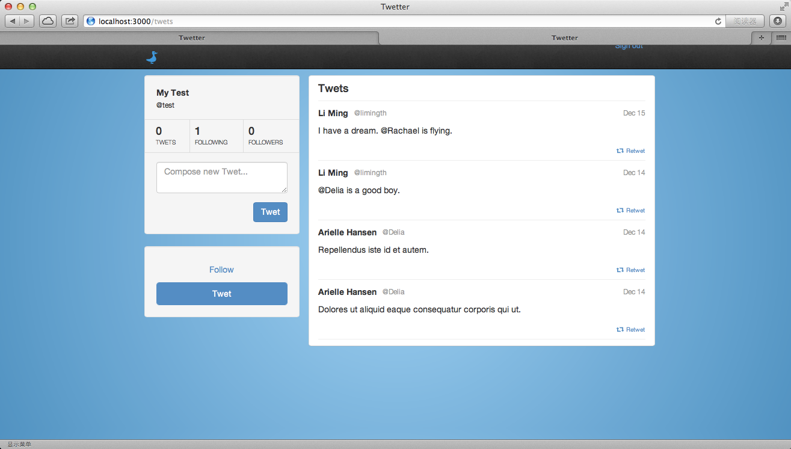
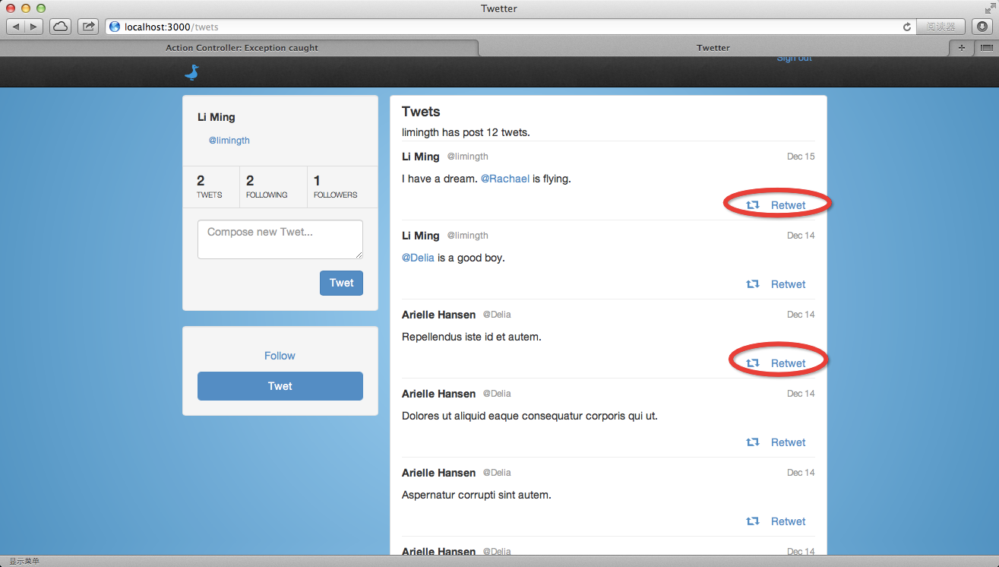
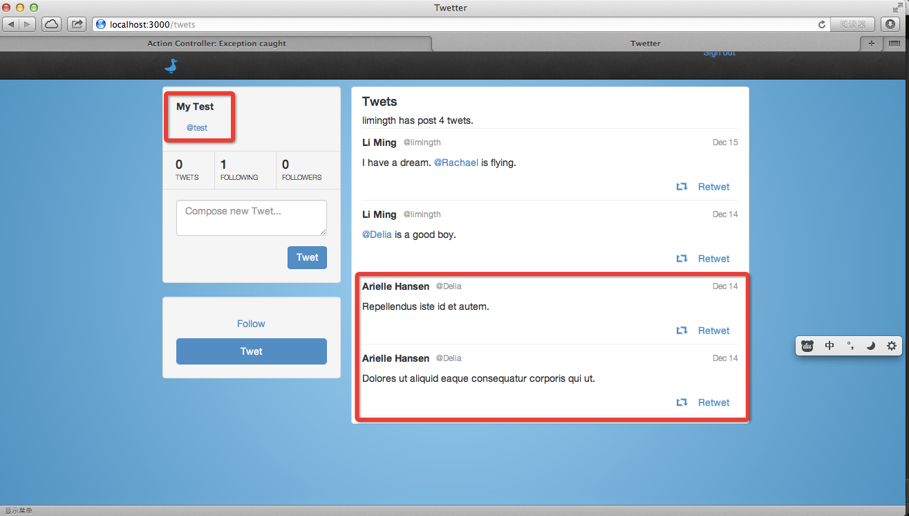
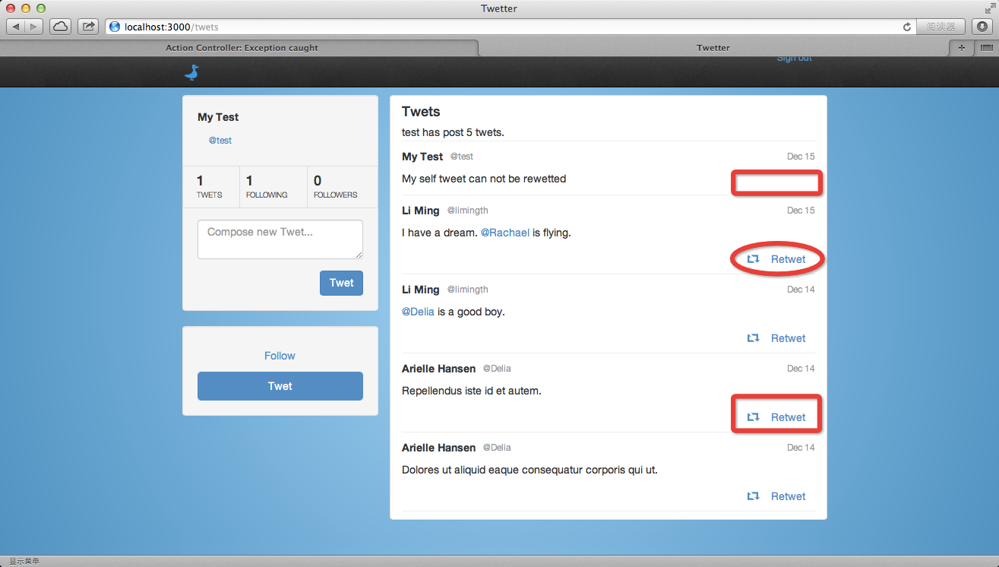

## Second Feature: retwet

### get a basic idea of what retwet looks like 
	limingth@gmail ~/Github/twetter$ git branch
	* master
	  myProfileBranch
	limingth@gmail ~/Github/twetter$ git branch -r
	  origin/HEAD -> origin/master
	  origin/complete
	  origin/gravatar
	  origin/master
	  origin/myProfileBranch
	  origin/profile
	  origin/retwet
	limingth@gmail ~/Github/twetter$ git checkout retwet
	Branch retwet set up to track remote branch retwet from origin.
	Switched to a new branch 'retwet'
	limingth@gmail ~/Github/twetter$ 

### restart rails server and view the pages http://localhost:3000/twets
	limingth@gmail ~/Github/twetter$ rake db:migrate RAILS_ENV=development
	==  CreateRetweets: migrating =================================================
	-- create_table(:retweets)
	   -> 0.0119s
	-- add_index(:retweets, [:tweet_id, :user_id])
	   -> 0.0009s
	==  CreateRetweets: migrated (0.0132s) ========================================

	==  ChangeRetweetToRetwet: migrating ==========================================
	-- rename_column(:retwets, :tweet_id, :twet_id)
	   -> 0.0150s
	==  ChangeRetweetToRetwet: migrated (0.0247s) =================================

	limingth@gmail ~/Github/twetter$ rails s
	=> Booting WEBrick
	=> Rails 4.0.0 application starting in development on http://0.0.0.0:3000
	=> Run `rails server -h` for more startup options
	=> Ctrl-C to shutdown server
	[2013-12-14 20:09:32] INFO  WEBrick 1.3.1
	[2013-12-14 20:09:32] INFO  ruby 2.0.0 (2013-06-27) [x86_64-darwin12.4.0]
	[2013-12-14 20:09:32] INFO  WEBrick::HTTPServer#start: pid=3983 port=3000

### sign up another user like @test, follow user limingth, then you see his retwets

## Now write code to implement that feature
### Step 0 - make sure you create a new branch myRetwet
	limingth@gmail ~/Github/twetter$ git checkout master
	Switched to branch 'master'
	limingth@gmail ~/Github/twetter$ git checkout -b myRetwet
	Switched to a new branch 'myRetwet'
	limingth@gmail ~/Github/twetter$ 

### Step 1 - add Retwet button to every twet 
	limingth@gmail ~/Github/twetter$ vi app/views/twets/index.html.erb 
	 14       <% @twets.each do |twet| -%>
	 15       <li>
	 16         <%= content_tag :strong, twet.user.name, :class => 'pull-left text-middle' %>
	 17         <a href="<%= twet.user.username %>" color='blue'><%= content_tag :small, "@"+twet.user.username, :class => 'text-muted pad-10 text-mi    ddle' %></a>
	 18         <%= content_tag :small, twet.created_at.strftime("%b %-d"), :class => 'text-muted text-middle pull-right' %>
	 19         

	 20         <%= content_tag :p, twet.content.gsub(/@(?<username>(\w+))/, '<a href="'+'\k<username>'+'">@\k<username></a>').html_safe %>
	 21         
	 22         

	 23           <%= content_tag :div, :class => 'pull-right' do %>
	 24             <%= form_for :retwet, :url => 'retwets_path', 
	 25                                    :method => 'POST',
	 26                                    :role => :form do |f| %>
	 27               <%= hidden_field_tag :return_to, request.original_url %>
	 28               <%= f.hidden_field :twet_id, :value => twet.id.to_s %>
	 29               
	 30               <%= f.submit "Retwet".html_safe, :class => 'btn btn-link smaller' %>
	 31             <% end %>
	 32           <% end %>
	 33         

	 34         
	 35       </li>
	 36       <li>
</li>
	 37       <% end -%>

### Step 2 - add retwets controller
	limingth@gmail ~/Github/twetter$ rails generate controller retwets
	      create  app/controllers/retwets_controller.rb
	      invoke  erb
	      create    app/views/retwets
	      invoke  rspec
	      create    spec/controllers/retwets_controller_spec.rb
	      invoke  helper
	      create    app/helpers/retwets_helper.rb
	      invoke    rspec
	      create      spec/helpers/retwets_helper_spec.rb
	      invoke  assets
	      invoke    coffee
	      create      app/assets/javascripts/retwets.js.coffee
	      invoke    scss
	      create      app/assets/stylesheets/retwets.css.scss
	limingth@gmail ~/Github/twetter$ 

### Step 3 - change url to retwets_path
	limingth@gmail ~/Github/twetter$ vi app/views/twets/index.html.erb 
	 23           <%= content_tag :div, :class => 'pull-right' do %>
	 24             <%= form_for :retwet, :url => retwets_path,
	 25                                    :method => 'POST',
	 26                                    :role => :form do |f| %>
	 27               <%= hidden_field_tag :return_to, request.original_url %>
	 28               <%= f.hidden_field :twet_id, :value => twet.id.to_s %>

### Step 4 - write retwets controller
	class RetwetsController < ApplicationController
	  before_filter :authenticate_user!

	  # POST /retwets
	  #
	  # This action attempts to create a new retwet instance for the Twet whose id matches
	  # params[:retwet][:twet_id]. If the retwet is created successfully, a success notice
	  # is set. Otherwise, an error notice is set. #smart_return is used to redirect appropriately.
	  #
	  def create
	    rt = current_user.retwets.create(retwet_params)
	    if rt.valid? and rt.persisted?
	      flash[:success] = "You retweted: #{rt.twet.content}"
	    else
	      flash[:error] = "We're sorry. You are unable to retwet that post."
	    end
	    smart_return
	  end

	  # DELETE /retwets/:id
	  #
	  # Responsible for un-retweting. Works by deleting the Retwet instance. The use of the
	  # resource method (defined below) ensures that only retwets which belong to the authenticated
	  # user can be matched and deleted. If the Retwet instance is not found or deleted successfully,
	  # an error notice is set. #smart_return is used to redirect appropriately.
	  #
	  def destroy
	    if resource.exists?
	      resource.destroy_all
	    else
	      flash[:error] = "We're sorry. We could not find that retwet."
	    end
	    smart_return
	  end

	  private

	  # Finds a retwet instance that matches the id passed and assigns it to @resource
	  # unless @resource is already assigned.
	  #
	  def resource
	    @resource ||= current_user.retwets.where(:id => params[:id])
	  end

	  # http://guides.rubyonrails.org/action_controller_overview.html#strong-parameters
	  #
	  # This method uses Strong Parameters to ensure that the data passed by the user
	  # is appropriate. If params[:retwet] does not exist or contains any key / value
	  # pairs other then :twet_id, an error will be raised and the page will return
	  # a 400 'Bad Request' HTML response code.
	  #
	  def retwet_params
	    params.require(:retwet).permit(:twet_id)
	  end

	  # Leverages the params[:return_to] value to direct the user back to a requested
	  # page. If no value is present, the user is directed back to the root path.
	  #
	  def smart_return
	    if params[:return_to].present?
	      redirect_to params[:return_to]
	    else
	      redirect_to root_path
	    end
	  end
	end

### Step 5 - Change routes
	limingth@gmail ~/Github/twetter$ vi config/routes.rb 
	  1 Twetter::Application.routes.draw do
	  2   devise_for :users
	  3   # The priority is based upon order of creation: first created -> highest priority.
	  4   # See how all your routes lay out with "rake routes".
	  5  
	  6   authenticated :user do
	  7     resources :follows, :except => [:new, :edit, :show, :update]
	  8     resources :retwets, :only => [:create, :destroy]
	  9     resources :twets, :except => [:new, :edit, :show, :update]
	 10   #  get ':username', :to => 'twets#index', :as => :profile
	 11     root :to => 'follows#index', :as => :user_root 
	 12   end
	 13   
	 14   # You can have the root of your site routed with "root"
	 15   root :to => 'home#index'

### Step 6 - user hasmany retwets
	limingth@gmail ~/Github/twetter$ vi app/models/user.rb 
	  6   has_many :follows
	  7   has_many :retwets
	  8   has_many :twets

### Step 7 - generate model Retwet
	limingth@gmail ~/Github/twetter$ rails generate model Retweets tweet_id:integer user_id:integer
	      invoke  active_record
	      create    db/migrate/20131215071059_create_retweets.rb
	      create    app/models/retweets.rb
	      invoke    rspec
	      create      spec/models/retweets_spec.rb
	      invoke      factory_girl
	      create        spec/factories/retweets.rb
	limingth@gmail ~/Github/twetter$ vi db/migrate/20131215071059_create_retweets.rb 
	limingth@gmail ~/Github/twetter$ cat db/migrate/20131215071059_create_retweets.rb 
	class CreateRetweets < ActiveRecord::Migration
	  def change
	    create_table :retweets do |t|
	      t.integer :tweet_id
	      t.integer :user_id

	      t.timestamps
	    end
	  end
	end
	limingth@gmail ~/Github/twetter$ 

### Step 8 - db migrate
	limingth@gmail ~/Github/twetter$ rake db:migrate RAILS_ENV=development
	==  CreateRetweets: migrating =================================================
	-- create_table(:retweets)
	   -> 0.0122s
	==  CreateRetweets: migrated (0.0130s) ========================================

	limingth@gmail ~/Github/twetter$ 

### Step 9 - add twet and user to retwet
	limingth@gmail ~/Github/twetter$ vi app/models/retwet.rb
	  1 class Retwet < ActiveRecord::Base
	  2   belongs_to :twet
	  3   belongs_to :user
	  4 
	  5   validates :twet, :presence => true
	  6   validates :user, :presence => true
	  7 end

### Step 10 - Modify modle Twet
	limingth@gmail ~/Github/twetter$ vi app/models/twet.rb 
	class Twet < ActiveRecord::Base
	  belongs_to :user

	  has_many :retwets

	  validates :content, :presence => true, :length => { :minimum => 2, :maximum => 140 }
	  validates :user, :presence => true

	  # Gets all twets made by the users referenced by the ids passed, starting with the 
	  # most recent twet made.
	  #
	  def self.by_user_ids(*ids)
	    [:flatten!, :compact!, :uniq!].each{ |meth| ids.send(meth) }
	    where(
	      arel_table[:user_id]
	      .in(ids)
	      .or(arel_table[:id].in(
	        Retwet.where(:user_id => ids).map(&:twet_id)
	      ))  
	    ).order('created_at DESC')
	  end 
	end

#### old version of class Twet
	class Twet < ActiveRecord::Base
	  belongs_to :user

	  validates :content, :presence => true, :length => { :minimum => 2, :maximum => 140 }
	  validates :user, :presence => true

	  # Gets all twets made by the users referenced by the ids passed, starting with the 
	  # most recent twet made.
	  #
	  def self.by_user_ids(*ids)
	    where(:user_id => ids.flatten.compact.uniq).order('created_at DESC')
	  end 
	end

* Now the retwet feature is almost finished

### one's own twet can not be retwetted
	limingth@gmail ~/Github/twetter$ vi app/views/twets/index.html.erb 
	 21 
	 22        

	 23           <% if can_retwet(twet) -%>
	 24           <%= content_tag :div, :class => 'pull-right' do %>
	 25             <%= form_for :retwet, :url => retwets_path,
	 26                                    :method => 'POST',
	 27                                    :role => :form do |f| %>
	 28               <%= hidden_field_tag :return_to, request.original_url %>
	 29               <%= f.hidden_field :twet_id, :value => twet.id.to_s %>
	 30               
	 31               <%= f.submit "Retwet".html_safe, :class => 'btn btn-link smaller' %>
	 32             <% end %>
	 33           <% end %>
	 34           

	 35           <% elsif has_retweted(twet) -%>
	 36           <%= content_tag :div, :class => 'pull-right' do %>
	 37             <%= form_for :retwet, :url => retwet_path(retwet(twet).id),
	 38                                    :method => 'DELETE',
	 39                                    :role => :form do |f| %>
	 40               <%= hidden_field_tag :return_to, request.original_url %>
	 41               
	 42               <%= f.submit 'Retweted', :class => 'btn btn-link text-success smaller' %>
	 43             <% end %>
	 44           <% end %>
	 45           

	 46           <% end %>     

#### compared to the former version
	 21         
	 22         

	 23           <%= content_tag :div, :class => 'pull-right' do %>
	 24             <%= form_for :retwet, :url => 'retwets_path', 
	 25                                    :method => 'POST',
	 26                                    :role => :form do |f| %>
	 27               <%= hidden_field_tag :return_to, request.original_url %>
	 28               <%= f.hidden_field :twet_id, :value => twet.id.to_s %>
	 29               
	 30               <%= f.submit "Retwet".html_safe, :class => 'btn btn-link smaller' %>
	 31             <% end %>
	 32           <% end %>
	 33         

### add can_retwet method to module TwetsHelper
	module TwetsHelper

	  # Returns true / false indicating whether the twet passed can be
	  # retweted by the authenticated user.
	  #
	  def can_retwet(twet)
	    if twet.user_id == current_user.id
	      return false
	    elsif has_retweted(twet)
	      return false
	    else
	      return true
	    end 
	  end 

	  # Returns true / false indicating whether the authenticated user
	  # has already retweted the twet passed.
	  #
	  def has_retweted(twet)
	    retwet(twet).present? ? true : false
	  end 

	  # Returns the actual retwet instance created by the authenticated user for 
	  # the twet passed
	  #
	  def retwet(twet)
	    current_user.retwets.where(:twet_id => twet.id).first
	  end 
	end

* Now the retwet feature is perfect

